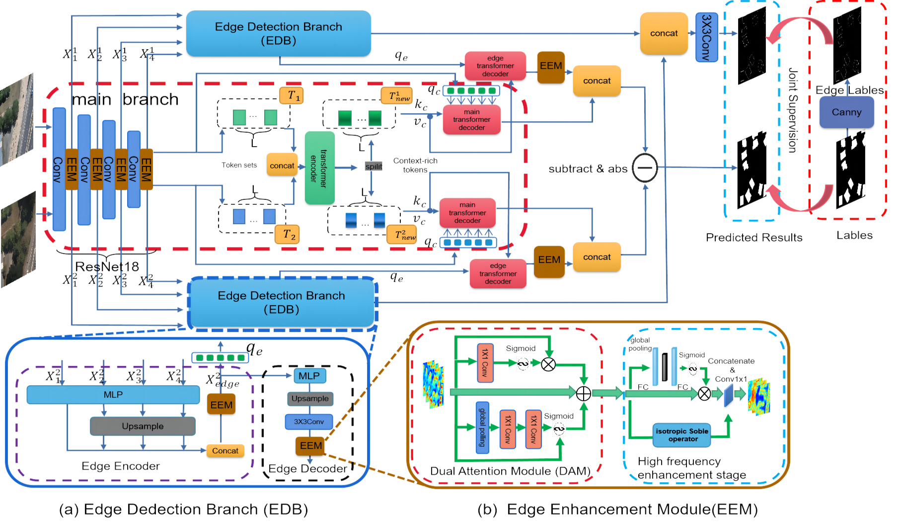

# EGENet: Edge-Guided Enhancement Network for Building Change Detection of Remote Sensing Images with a Hybrid CNN-Transformer Architecture
Here, we provide the pytorch implementation of the paper: Edge-Guided Enhancement Network for Building Change Detection of Remote Sensing Images with a Hybrid CNN-Transformer Architecture
For more information, please see our paper at [IGARSS](https://ieeexplore.ieee.org/document/10640690). 

## Network Architecture


## 1. Environment setup

```
conda create -n egenet python=3.8
conda activate egenet
pip install -r requirements.txt
```
## 2. Dataset Preparation

### Data structure

```
"""
Change detection data set with pixel-level binary labels；(WHU256 or LEVIR-CD-256)
├─A
├─B
├─label
├─label_edge
└─list
"""
```

`A`: images of t1 phase;

`B`:images of t2 phase;

`label`: label maps;

`label_edge`: using the Canny edge detection operator on theusing the Canny edge detection operator on the label maps;

`list`: contains `train.txt, val.txt and test.txt`, each file records the image names (XXX.png) in the change detection dataset.


## 3. Download the datesets:
* LEVIR-CD:
[LEVIR-CD](https://pan.baidu.com/s/1gDS6Ea37zfHoZ4832jT9cg?pwd=BUPT)
* WHU-CD:
[WHU-CD](https://github.com/Jnmz/EGENet-IG24/releases/download/1/WHU256.zip)

and put them into data directory. In addition, the processed whu dataset can be found in the release.

## 4. Download the models (pretrain models):

* [resnet18](https://download.pytorch.org/models/resnet18-5c106cde.pth) 

and put it into pretrain directory.

## 5. Train & Test
The following are scripts for different networks and datasets, run according to your needs

    python main_cd.py --project_name 'EGENet_LEVIR' --data_name 'LEVIR' --net_G 'EGENet'
    python main_cd.py --project_name 'EGENet_WHU' --data_name 'WHU' --net_G 'EGENet'
    python main_cd.py --project_name 'EGCTNet_LEVIR' --data_name 'LEVIR' --net_G 'EGCTNet'
    python main_cd.py --project_name 'EGCTNet_WHU' --data_name 'WHU' --net_G 'EGCTNet'
    python main_cd.py --project_name 'BIT_LEVIR' --data_name 'LEVIR' --net_G 'BIT' --loss 'ce'
    python main_cd.py --project_name 'BIT_WHU' --data_name 'WHU' --net_G 'BIT' --loss 'ce'
    python main_cd.py --project_name 'ICIF_Net_LEVIR' --data_name 'LEVIR' --net_G 'ICIF_Net' --loss 'ce'
    python main_cd.py --project_name 'ICIF_Net_WHU' --data_name 'WHU' --net_G 'ICIF_Net' --loss 'ce'
    python main_cd.py --project_name 'ChangeFormer_LEVIR' --data_name 'LEVIR' --net_G 'ChangeFormer' --loss 'ce'
    python main_cd.py --project_name 'ChangeFormer_WHU' --data_name 'WHU' --net_G 'ChangeFormer' --loss 'ce'
    
## References
Appreciate the work from the following repositories:

- [EGCTNet](https://github.com/chen11221/EGCTNet_pytorch) (Our EGENet is implemented on the code provided in this repository)
